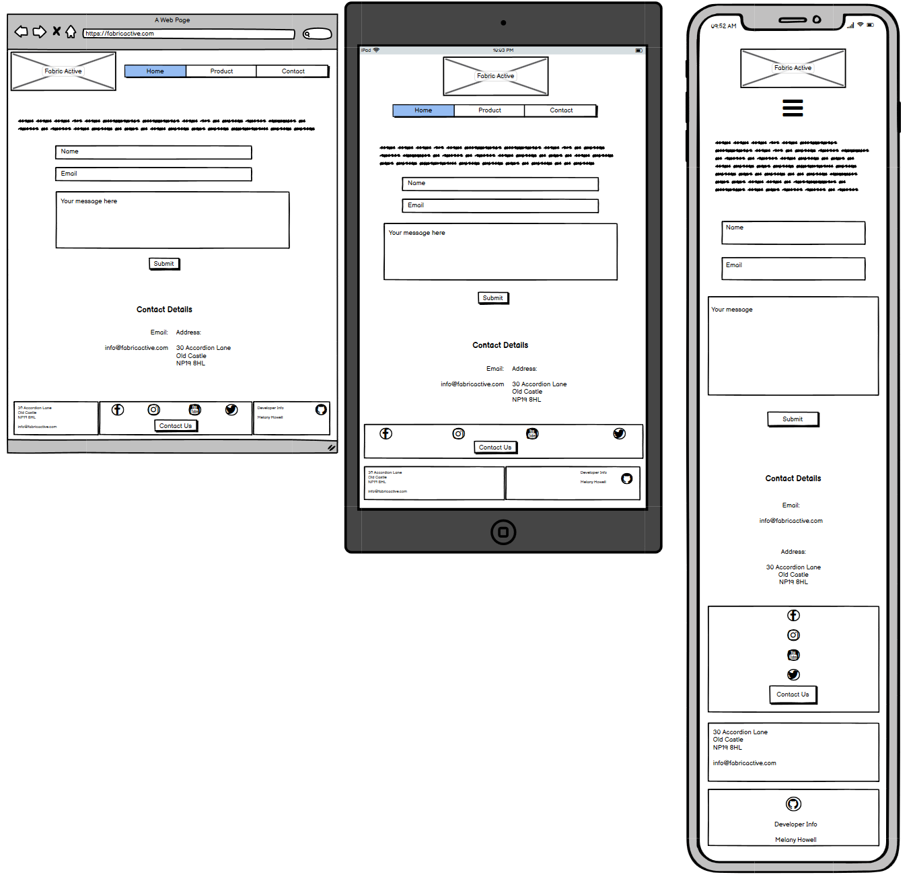

# Portfolio Project 1 - HTML/CSS Essentials

Fiber Active is a company that has created a specialised material that is Eco friendly, comfortable and outperforms other outdoor materials in its field. [This Site](https://melanyhowell.github.io/Project1-Fabricactive/) is here to explain firstly what Fibre Active is about and also the product they ahve just developed and are ready to sell.

## Live Site
[Fiber Active](https://melanyhowell.github.io/Project1-Fabricactive/)

## Repository
[https://github.com/melanyhowell/Project1-Fabricactive](https://github.com/melanyhowell/Project1-Fabricactive)

---

## Contents
+ [Objectives](#Objectives)
+ [Breif](#breif)
+ [Target Audience](#target-audience)
+ [User Experience: UX](#user-exerience-ux)
    + [Initial Concept](#initial-concept)
    + [User Stories](#user-stories)
    + [Wireframes](#wireframes)
        + [Home Page](#home-page)
        + [Product Page](#productservices-page)
        + [Contact Form Page](#contact-form-page)
        + [Form Confirmation Page](#form-confirmation-page)
    + [Site Structure](#site-structure)
    + [Colour Pallette](#colour-pallette)
    + [Typography](#typography)
    + [Imagery](#imagery)
+ [Features](#features)
    + [Included Features](#included-features)
        + [Header](#header)
        + [Home](#home)
        + [Footer](#footer)
        + [Product Page](#product-page)
            + [Product Information](#product-information)
        + [Contact Page](#contact-page)
            + [Contact Form](#contact-form)
            + [Form Confirmation](#form-confirmation)
        + [Future Features](#future-features)
    + [Technologies Used](#technologies-used)
    + [Testing](#testing)
    + [Deployment](#deployment)
    + [Credits](Credits)
        + [Content](#content)
        + [Media](#media)
        + [Code](#code)
    + [Acknowledgements](#acknowledgements)

---

## Objectives
This project has 2 main requirments:
+ Build a static front-end site that presents relevant data in an clear and effective way using all the technologies I have learned so far regarding HTML & CSS langauages.
+ Exhibit the required data to allow users to learn more about the brand/product and even make an infomed decision on wether to make a purchase, and the owners to accomplish their goals of marketing themselves and their product to users.

## Breif
The website for Fiber Active needs to promote their knowlege and expertise in the field of outdoor clothing materials, advertising their latest breakthrough on their most recent product that pushes their outdoor clothing ahead of their competition.

The features that have been agreed to and requested by Fiber active are:
+ Introduction to company
+ Detail on company and their research
+ Link to product
+ About product and why it's so special
+ Contact link and Form to request more info on product or company
+ Comapny's social media links

## Target Audience 
Companies looking for alterantive sources for their manufacturing to upgrade their green credentials.
Individuals who are interested in using the products for eco-friendly hobbies or work.

---

## User Exerience: UX

### Initial Concept
I want to set forward a professional and clean look for the website while still showing its roots in nature. keeping things uncluttered and clear will help guide the user in quickly utilising the website for their needs. Technology websites like [Apple website](https://www.apple.com/uk/), [OnePlus Website](https://www.oneplus.com/uk), [National Gallery](https://www.nationalgallery.org.uk/) and [Oxford Fabric Website](https://www.oxford-fabric.com/product/)

### User Stories

I am a user that requires the following things when using this site;

+ Site from inital loading needs to be clear with its purpose
+ Navigation must be smooth and simple
+ Easy to read infomation that isn't too technical
+ Enable me to access request the product info and how to buy
+ Straigtforward contact process
+ Be able to see Fiber Active's social presence
+ See who the developer was and what their information is

As the owner I want the following from my site;

+ Clear & professional presence
+ Background on company
+ Info on product ranges
+ Ways for people to get in contact with us

As a developer I am looking to provide the following;

+ Easy to use and accessible
+ Tidy professional look
+ Makes visitors want to explore/return
+ satisfies Owner and vistitors needs

### Wireframes

I created my Wireframes using [Balsamiq](https://balsamiq.com). Some aspects I have decided to adapt and change due to accomodating design features or requierments that weren't originally anticipated.

#### Home Page

#### Product/Services Page

#### Contact Form Page

#### Form Confirmation Page

### Site Structure

Fabric Active is 3 pages with the home page being the landing page and all pages and social links accessible from all pages allowing for easy navigation.
4th page is the Page confirming submission of the contact form

### Colour Pallette

Finding a complementry colour pallette that doesn't distract from the goals of the website has been tricky while maintaining an aspect of nature in the features. I used both  [My Color space webiste](https://mycolor.space/?hex=%23F76C53&sub=1) to help selct my colour pallette from there.

I used [Web Aim Website](https://webaim.org/resources/contrastchecker/) and my original colours not passing all the contrast tests.

### Typography

The two fonts selected are Odswald and Figtree imported from [Google Fonts](https://fonts.google.com/).
I chose these fonts as they bring a casual look to the site while still maintaining a professional visual.

### Imagery

Relating the images back to the eco-friendly product descriptions.
By using a site like [compressor.io] to compress the files this should allow for faster loading times.

---

## Features

The features I have utilised are intended to be used to create an easy flowing experince for any user, allowing them to easily navigate through the site to find the infomration they are looking for, enabling a positive user experience.

### Included Features

#### Header

+ Logo - allows identification of brand and a clickable link to take you back to the default landing page
+ Navigational Bar - Allows access to all pages throughout the site at all times.

#### Home

Some info on Fabric Active and their objectives, includinging images.

#### Footer

+ Social Media Links for Faric Active brand
+ Contact links that will take you to contact page
+ Social links for Developers Github and Linkedin

### Product Page

#### Product Information

+ Detailed information on product
+ Images
+ Enquiry Button

### Contact Page

#### Contact Form

+ Contact Form
    + Name
    + Email
    + Message Area
#### Form Confirmation

A message confirming Form has been submitted
### Future Features

+ A buy now feature 
+ More products under a product gallery
+ Product options such as colour, size and quantity
+ Google Maps feature
+ Showing how many products are in stock
+ Customer account feature so customers can keep track of orders

---

## Technologies Used

+ [HTML5](https://html.spec.whatwg.org/)
+ [CSS](https://www.w3.org/Style/CSS/Overview.en.html)
+ [Balsamic](https://balsamiq.com/wireframes/)
+ [Coolers.co](https://coolors.co/)
+ [MyColor](https://mycolor.space/?hex=%23F76C53&sub=1)
+ [WebAim](https://webaim.org/resources/contrastchecker/)
+ [Google Fonts](https://fonts.google.com/)
+ [Font Awesome](https://fontawesome.com/)
+ [Chrome Developer Tools](https://developer.chrome.com/docs/devtools/)
+ [GitHub](https://github.com/)
+ [GitPod](https://www.gitpod.io/)
+ [Multi Device Mock Up Generator](https://techsini.com/multi-mockup/)
+ [Bootstrap](https://getbootstrap.com/docs/5.2/getting-started/introduction/)

---

## Testing

To see what tools I used and how I overcame bugs and flaws in my devlopment journey of the Fiber Active site please [click here](testing.md) 

## Deployment

The site was deployed to GitHub pages.

+ Go To your Git Hub Repository
+ Under Repository Name, click on "Settings" 

+ Click on "Pages" options on the left hand side of the screen

+ under "build & deployment, & under "source" select "main Branch".
+ and then select publishing source "(root)
+ click Save
+ this will then give you your Git Pages address

## Credits

### Content

+ Mentor Harry gave a great insight into the how the layout should be progressed
+ For my README.md I saught inspiration from [Tasha Taylor Johnsons's Repository](https://github.com/TashaTJ/pawsome-portraits-v4/blob/main/README.md) as her layout really helped me understand what is expected from creating my first README.

### Media

Obtained from the free photo sites such as 
+ [Pexels](https://www.pexels.com/) for Background Image
+ [unspalsh](https://unsplash.com/)

+ [Wendy van Zyl – pexels](https://www.pexels.com/photo/selective-focus-photography-of-assorted-coloured-thread-spools-1212179/)
+ [Surene Palvie – pexels](https://www.pexels.com/photo/assorted-color-yarns-on-brown-wicker-basket-2070676/)
+ [DESIGNECOLOGIST  - unsplash](https://www.pexels.com/photo/leaves-hang-on-rope-1389460/)
+ [Ekaterina Grosheva  - unsplash](https://unsplash.com/photos/wcdHwuFJfn4)
+ [Vitalijs Barilo - unsplash](https://unsplash.com/photos/azMZaQCUyV8)

### Code

+ Issues I used the following references;
    + [W3Schools](https://www.w3schools.com/)
    + [Bootstrap](https://getbootstrap.com/docs/5.2/getting-started/introduction/)
    + [Code Institute](https://learn.codeinstitute.net/courses/course-v1:CodeInstitute+CSE101+2020_Q2/courseware/be0e510a3aca4bccb6e0bba4cf7cf06b/5255d165b5284d728b13bd224144d984/)
    + [MDN](https://developer.mozilla.org/en-US/)

## Acknowledgements

This Site was developed for the purpose of my portfolio 1 Project for the full stack diploma.
Thanks to my Mentor Harry Dhillon for his support.

Melany Howell 2022